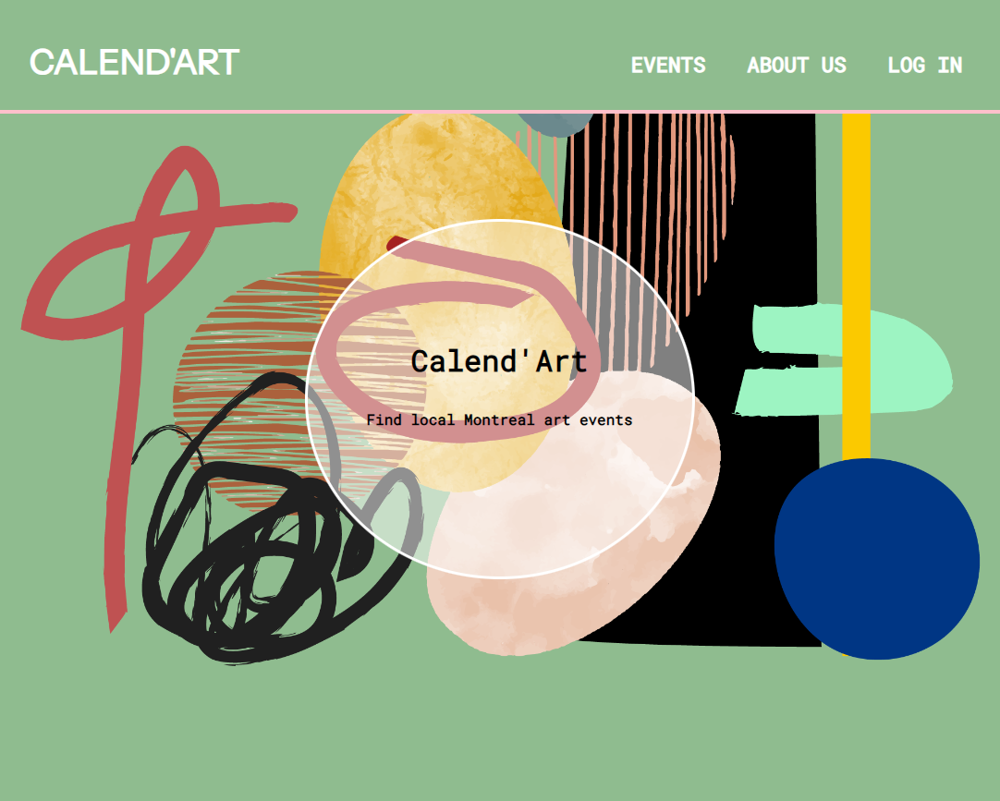

# calendart

React app

## Calend'Art Website -

This is a website built to organize all the art events taking place in the city of Montreal in one spot. Users can browse events uploaded by the admin without a login, while the admin manages(edit, delete, upload) all events when logged in as admin.

## API endpoints

"/calend_art/events/read" //get all events

"/calend_art/events/:eventId"//get one event

"/calend_art/users/read" //get users

"/calend_art/events/create" //create an event

"/calend_art/users/signin" //Login

"/calend_art/events/delete/:eventId" //delete an event

"/calend_art/events/update/:eventId" //update an event

## Technology Used
### Frontend
*Create React APP // Creating a React app and its environment
*React hooks // Management of UI components
*React Router // Management of router
*styled-components // Style with CSS-in-JS components
*fetch // Communicating with back-end server (Node.js) via API
*Vercel // Deployed via Vercel

### Backend
*Node.js // Backend environment
*MongoDB // Storing data
*Vercel // Deployed via Vercel
